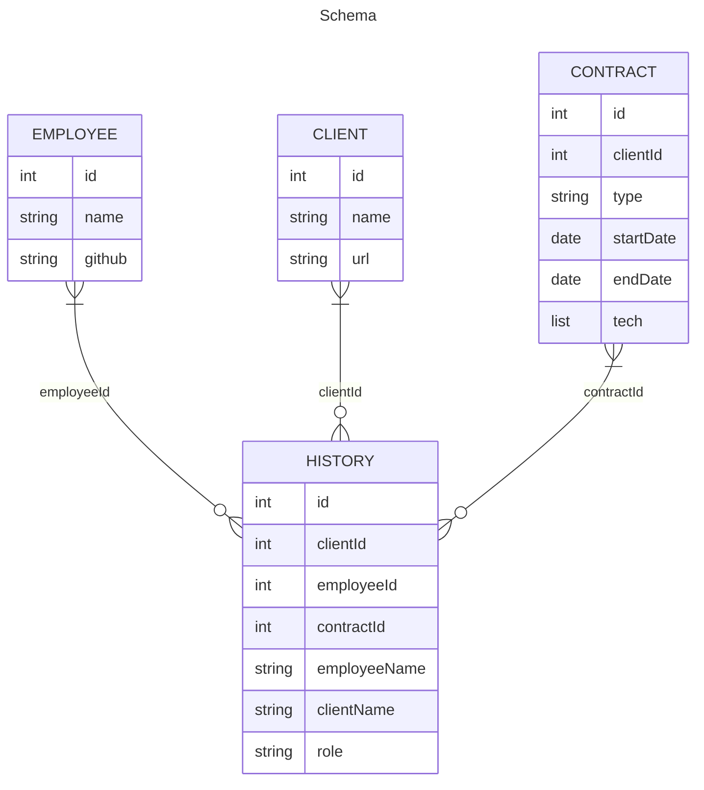

15
# simple-tracker-express
Simple api for tracking work made with vanilla javascript using expressjs. Meant to be forked/extended/replaced

- [web server](https://github.com/boxboat-github-practice/simple-tracker-express-web)

